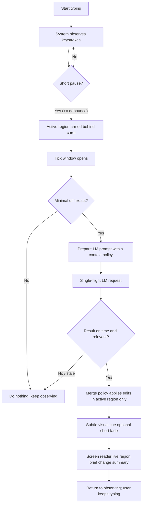
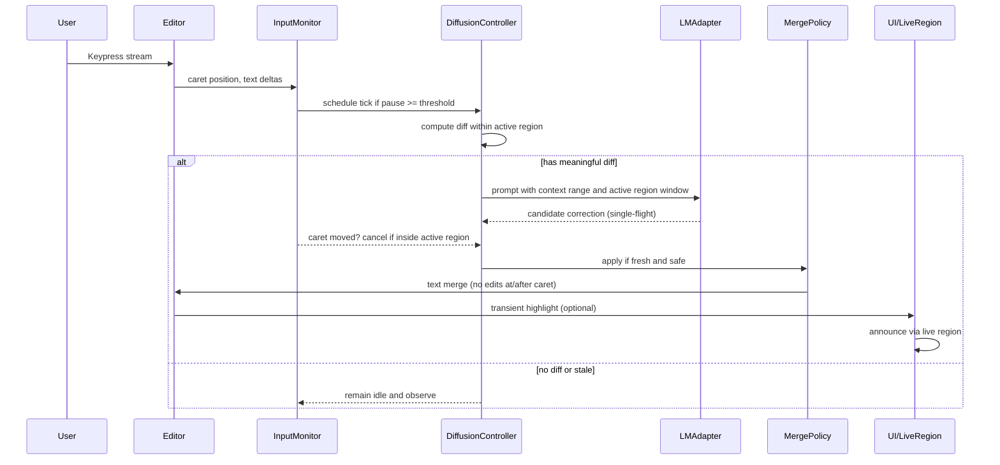
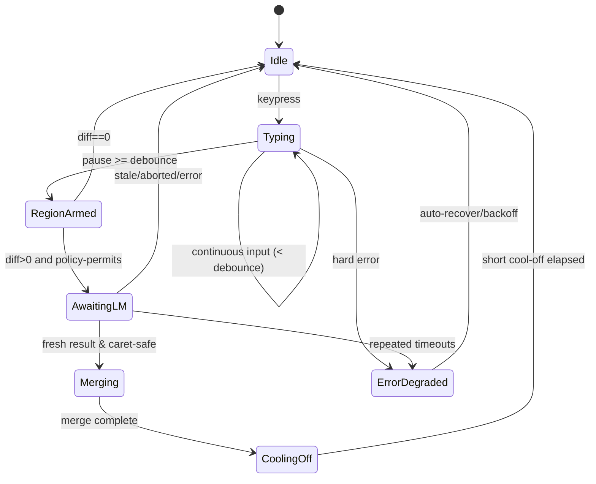
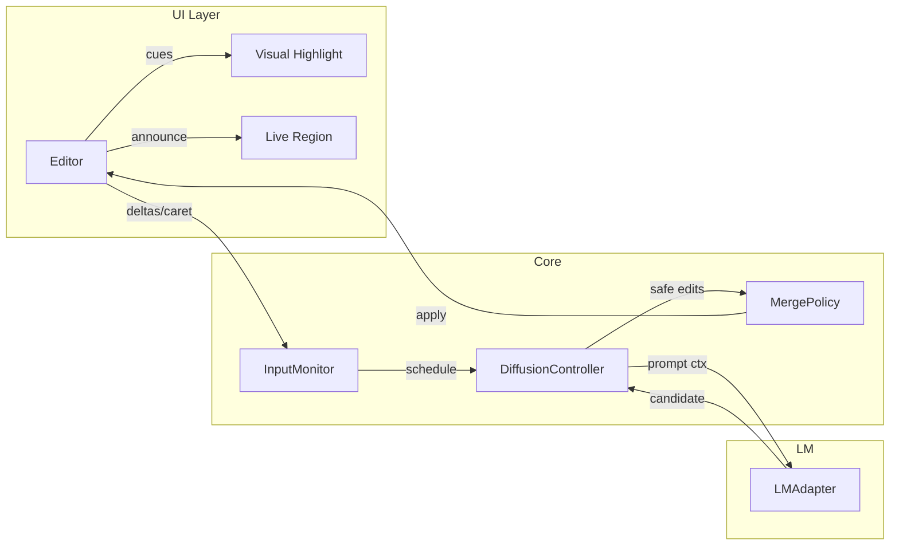

<!--══════════════════════════════════════════════════════════
  ╔══════════════════════════════════════════════════════════════╗
  ║  ░  T Y P I N G   &   L M   C O R R E C T I O N   G U I D E  ║
  ║                                                              ║
  ║                                                              ║
  ║                                                              ║
  ║                                                              ║
  ║           ╌╌  P L A C E H O L D E R  ╌╌                      ║
  ║                                                              ║
  ║                                                              ║
  ║                                                              ║
  ║                                                              ║
  ╚══════════════════════════════════════════════════════════════╝
    • WHAT ▸ Visual guide to the hands-off typing + LM correction flow
    • WHY  ▸ Align UX, timing, and safety with Core behaviour
    • HOW  ▸ Mermaid diagrams + narrative; renders natively in GitHub
-->

## Overview

This guide shows what users see, do, and feel during typing while the LM
provides hands-off automatic corrections. It visualizes the orchestration
implemented in `core/` (Typing Monitor, Diffusion Controller, Policies) and
the guardrails that keep edits safe around the active region (formerly
“tapestry”).

- **User sees**: Their own text; subtle, low-distraction refinements appearing
  just behind the caret. Optional gentle highlights fade quickly; screen
  readers receive concise live-region messages.
- **User does**: Just types. No menus or modal prompts. Corrections flow in
  when it’s safe; the user’s momentum is preserved.
- **User feels**: Supported, not overruled. Confidence grows as spelling and
  phrasing quietly improve. Flow is maintained by avoiding focus shifts and
  preventing edits at/after the caret.
- **Flow originates**: From predictable cadence, active-region-bounded merges, and the
  absence of interaction costs. The system times itself to the user, not the
  other way around.

### Principles respected

- No edits at/after the caret; merges occur only within the active region
  behind the caret.
- Single‑flight LM calls with abort; stale results are dropped.
- Device-tier aware cadence and token limits; silent degrade on errors.
- Accessibility first: reduced motion honored; SR announcements minimal.

---

## 1) Journey map (what the user experiences)



Notes:

- Visual cue is intentionally low-salience; users in reduced-motion mode see a
  non‑animated, faint highlight or none at all, per settings.
- Live-region announcements are batched and deduped to avoid verbosity.

---

## 2) Sequence diagram (orchestration)



---

## 3) State machine (safety and cadence)



---

## 4) Cadence timeline (ticks, windows, guardrails)

```mermaid
gantt
    title Cadence across typing bursts
    dateFormat  X
    axisFormat  %Lms
    section Input
    Keystrokes (burst)          :active, 0, 200
    Pause (debounce window)     : 200, 120
    section Controller
    Tick window #1              : 260, 50
    Tick window #2              : 350, 50
    section LM
    Single-flight request       : 265, 140
    section Merge
    Merge in active region (safe zone)   : 410, 40
    Visual cue fade             : 450, 120
```



Guidance:

- Actual durations are device-tier dependent and tuned via policy.
- If the caret enters the active region while the LM is in-flight, we abort and drop
  the result to prevent caret‑adjacent edits.

---

## 5) Architecture map (where responsibilities live)



---

## 6) What users will see/do/feel (concise spec)

- **See**: Subtle corrections appear just behind the caret; no popups.
- **Do**: Keep typing; never forced to accept/deny. Native undo works.
- **Feel**: Supported; uninterrupted flow; corrections feel timely and yours.

Accessibility:

- Honors reduced motion; highlights may be disabled or non-animated.
- Live-region announces short, high-signal messages (e.g., “fixed spelling”).
- No role/ARIA changes that steal focus.

---

## 7) Critical UX analysis and improvements

Where hands‑off can fail, and how to improve:

- **Over-eager corrections**: If cadence is too aggressive, text thrash can
  break flow. Improve via adaptive debounce that learns per‑user tempo and
  introduces a short cool‑off after merges.
- **Semantic drift**: LM suggestions may subtly alter meaning. Clamp length,
  prefer high‑precision edits, and bias policies to spelling/grammar within
  a narrow active region by default; expand scope only when confidence is high.
- **Caret collision**: Late LM results landing as the caret returns can feel
  jarring. Enforce strict abort on caret entry and require a fresh diff before
  any merge.
- **Perceived agency**: Even hands‑off flows should feel optional. Offer a
  plainly labeled toggle for highlight intensity and an “show change marks”
  view in debug/dev builds; keep defaults quiet.
- **Latency spikes**: On low-tier devices, long in-flight periods harm trust.
  Tier‑aware timeouts and immediate degrade‑to‑rules‑only maintain stability.
- **Cognitive load for SR users**: Batch announcements; limit to one concise
  message per merge; allow users to disable non‑critical announcements.
- **Warm‑up hiccups**: First‑run stalls break momentum. Preflight assets and
  warm up once after load; log quiet hints for local model setup when needed.

KPIs to watch:

- Merge acceptance rate (implicit; low undo usage).
- Typing throughput before vs after enabling corrections.
- Correction latency p50/p95 by device tier.
- SR verbosity score (announcements per minute during bursts).

---

## 8) Flow-state design notes

- **Predictability**: Fixed yet adaptive cadence establishes rhythm.
- **Low salience**: Minimal, fast‑fading cues; never alter viewport or focus.
- **Safety**: Active region-bounded merges avoid caret friction; undo is native.
- **Respect**: User remains author; corrections are suggestions expressed as
  done‑for‑you edits, not commands.

---

## Appendix: How to export diagrams as images (optional)

These Mermaid blocks render on GitHub automatically. If you need static image
assets for slideware, use the Mermaid CLI locally:

```bash
pnpm dlx @mermaid-js/mermaid-cli -i README.md -o diagrams
```

This will emit PNG/SVGs for each diagram block under `diagrams/`.
