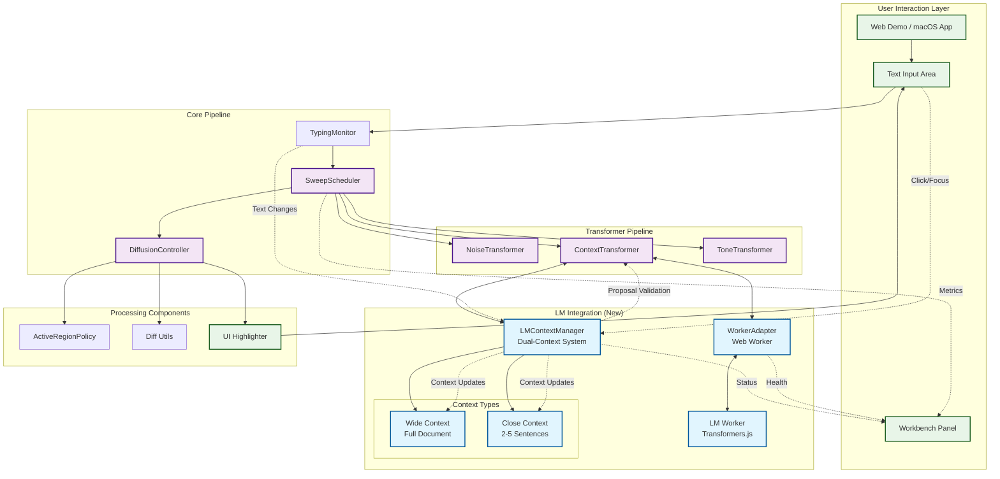

<!--══════════════════════════════════════════════════
  ╔══════════════════════════════════════════════════════╗
  ║  ░  L M   I N T E G R A T I O N   A R C H  ░░░░░░░░░  ║
  ║                                                      ║
  ║                                                      ║
  ║                                                      ║
  ║                                                      ║
  ║           ╌╌  P L A C E H O L D E R  ╌╌              ║
  ║                                                      ║
  ║                                                      ║
  ║                                                      ║
  ║                                                      ║
  ╚══════════════════════════════════════════════════════╝
    • WHAT ▸ Dual-context LM architecture and integration flow
    • WHY  ▸ Document the new LM system for maintainability
    • HOW  ▸ Visual diagrams and component relationships
-->

# LM Integration Architecture

This document describes the dual-context Language Model integration architecture implemented in MindType v0.4+.

## Overview

The LM integration uses a dual-context approach to balance global document awareness with focused, performant corrections:

- **Wide Context**: Full document awareness for semantic coherence
- **Close Context**: 2-5 sentences around caret for focused corrections
- **Click-to-Activate**: LM initialization triggered by user interaction
- **Context Validation**: Proposals validated against wide context for coherence

## Architecture Diagram



## Component Details

### LMContextManager (`core/lm/contextManager.ts`)

**Purpose**: Orchestrates the dual-context system for LM processing.

**Key Features**:
- **Click-to-Activate**: Initializes on user focus/click events
- **Wide Context**: Maintains full document awareness with token estimation
- **Close Context**: Tracks 2-5 sentences around caret position
- **Real-time Updates**: Updates contexts as user types and moves caret
- **Proposal Validation**: Validates LM proposals against wide context

**API**:
```typescript
interface LMContextManager {
  initialize(fullText: string, caretPosition: number): Promise<void>;
  isInitialized(): boolean;
  updateWideContext(fullText: string): void;
  updateCloseContext(fullText: string, caretPosition: number): void;
  getContextWindow(): LMContextWindow;
  validateProposal(originalText: string, spanStart: number, spanEnd: number, proposalText: string): boolean;
}
```

### WorkerAdapter (`core/lm/workerAdapter.ts`)

**Purpose**: Web Worker integration for offloading LM processing from main thread.

**Key Features**:
- **Non-blocking Processing**: Runs LM in Web Worker to maintain UI responsiveness
- **Streaming Support**: Handles token streaming from LM
- **Error Recovery**: Comprehensive error handling and timeout management
- **Health Monitoring**: Tracks worker status and performance metrics

### Enhanced ContextTransformer (`engines/contextTransformer.ts`)

**Purpose**: Integrates LM processing into the core transformer pipeline.

**Key Features**:
- **Dual-Context Integration**: Uses both wide and close context for corrections
- **LM Streaming**: Processes streaming LM responses
- **Context Validation**: Validates proposals using LMContextManager
- **Fallback Handling**: Graceful fallback to deterministic corrections

## Data Flow

### 1. Initialization Flow
```
User Focus/Click → LMContextManager.initialize() → Wide + Close Context Setup
```

### 2. Text Processing Flow
```
Text Change → TypingMonitor → SweepScheduler → ContextTransformer
                                                      ↓
LMContextManager ← Context Updates ← ContextTransformer
                                                      ↓
WorkerAdapter ← LM Request ← ContextTransformer
                                                      ↓
LM Worker → Streaming Response → WorkerAdapter → ContextTransformer
                                                      ↓
LMContextManager ← Proposal Validation ← ContextTransformer
                                                      ↓
Validated Proposal → DiffusionController → UI Update
```

### 3. Context Update Flow
```
Text/Caret Change → LMContextManager.updateWideContext()
                                   ↓
                   LMContextManager.updateCloseContext()
                                   ↓
                   Context Window Available for LM Processing
```

## Configuration

### Context Settings (`config/defaultThresholds.ts`)
- `sentenceContextPerSide`: Number of sentences per side for close context (default: 3, range: 2-5)
- Confidence thresholds for proposal acceptance
- Token limits for wide context processing

### Performance Considerations
- Wide context is truncated to 2000 characters for performance
- Close context uses sentence segmentation via `Intl.Segmenter`
- Token estimation uses word count as proxy
- Context validation prevents drastic length changes (>50%)

## Integration Points

### Web Demo Integration (`web-demo/src/App.tsx`)
- Global context manager exposure: `(globalThis as any).__mtContextManager`
- Click-to-activate event handling: `onFocus={handleTextareaFocus}`
- Real-time context status in workbench LM tab
- Context initialization state management

### Core Pipeline Integration (`core/sweepScheduler.ts`)
- LM adapter passed to context transformer
- Global context manager access for sweep processing
- Async processing support for LM streaming

## Monitoring and Debugging

### Workbench Integration
- **LM Tab**: Shows context initialization status, worker health, token counts
- **Metrics**: Tracks LM processing latency and performance
- **Logs**: Comprehensive logging for debugging LM issues

### Debug Logging
- Context manager operations: `[lm.context]` prefix
- Context transformer LM processing: `[ContextTransformer]` prefix
- Worker adapter communication: `[WorkerAdapter]` prefix

## Error Handling

### Context Manager
- Initialization failure handling
- Context update error recovery
- Proposal validation rejection logging

### Worker Adapter
- Worker creation failure handling
- Timeout management (30-second default)
- Error propagation from worker to UI
- Health status monitoring

### Context Transformer
- LM processing failure fallback to deterministic corrections
- Context validation rejection handling
- Streaming error recovery

## Future Enhancements

### Planned Improvements
- Advanced semantic similarity validation
- Context compression for large documents
- Multi-language context segmentation
- Performance optimization for real-time updates

### Extension Points
- Custom validation functions
- Pluggable context strategies
- Alternative LM backends
- Context caching mechanisms

This architecture provides a robust foundation for LM integration while maintaining performance and reliability through the dual-context approach and comprehensive error handling.
