<!--══════════════════════════════════════════════════════════
  ╔══════════════════════════════════════════════════════╗
  ║  ░  SYSTEM ARCHITECTURE — MINDTYPER v0.3  ░░░░░░░░░  ║
  ║                                                      ║
  ║                                                      ║
  ║                                                      ║
  ║                                                      ║
  ║           ╌╌  P L A C E H O L D E R  ╌╌              ║
  ║                                                      ║
  ║                                                      ║
  ║                                                      ║
  ║                                                      ║
  ╚══════════════════════════════════════════════════════╝
    • WHAT ▸ System architecture overview (left→right, layered)
    • WHY  ▸ Communicate operational flow, safety gates, and cores
    • HOW  ▸ Mermaid flowchart with grouped subgraphs and labeled edges
-->

## MindTyper v0.3 — System Architecture

```mermaid
%%{init: {
  'flowchart': { 'curve': 'step', 'nodeSpacing': 16, 'rankSpacing': 40, 'htmlLabels': true },
  'theme': 'neutral'
}}%%
flowchart LR

  %% Host & OS Integrations (slate)
  subgraph host["Host & OS Integrations"]
    host_bindings["Platform Bindings — macOS Swift · Windows TSF · Web WASM"]
    host_editor["Editor / Text Field"]
    host_undo["Undo Bridge"]
    host_secure["Secure Field / IME State"]
  end
  style host fill:#cbd5e1,stroke:#475569,stroke-width:1px,color:#111

  %% Input & Caret Layer (light grey)
  subgraph input["Input & Caret Layer"]
    input_keys["Keystrokes"]
    input_caret["Caret Monitor — detects typing · pause · caret-entered"]
    input_active["Active Region Policy — 3–8 words behind caret; ~80–120 characters"]
  end
  style input fill:#f5f5f5,stroke:#9ca3af,stroke-width:1px,color:#111

  %% Policy & Safety Layer (amber)
  subgraph safety["Policy & Safety Layer"]
    safety_tier["Device Tier Detector — WebGPU → WASM → CPU"]
    safety_policy["Runtime Policy Manager — band size · debounce · token budget"]
    safety_sec["Security Gate — blocks edits in secure fields or during IME"]
    safety_conf["Confidence Gates — τ_noise · τ_ctx · τ_tone"]
    safety_prefs["User Preferences — reduced-motion · tone profile · marker glyph"]
  end
  style safety fill:#fde68a,stroke:#b45309,stroke-width:1px,color:#111

  %% Orchestration (green)
  subgraph orches["Orchestration"]
    orch_bus["Event Bus"]
    orch_sched["Scheduler — single-flight + cooldown"]
    orch_abort["Abort Controller — triggers rollback on caret entry"]
  end
  style orches fill:#dcfce7,stroke:#16a34a,stroke-width:1px,color:#111

  %% Transformers (blue)
  subgraph transf["Transformers"]
    tr_noise["NoiseTransformer — real-time typo, repeat, transposition fixes"]
    tr_ctx["ContextTransformer — sentence repair on pause with local LM"]
    tr_tone["ToneTransformer — polish punctuation, capitalisation, stylistic consistency"]
  end
  style transf fill:#dbeafe,stroke:#3b82f6,stroke-width:1px,color:#111

  %% Local Model Runtime (teal)
  subgraph runtime["Local Model Runtime"]
    rt_backend["Backend Selector — WebGPU → WASM → CPU"]
    rt_runner["LM Runner — constrained, plain-text infill"]
  end
  style runtime fill:#ccfbf1,stroke:#0f766e,stroke-width:1px,color:#111

  %% Rust Core (purple)
  subgraph rust["Rust Core"]
    rc_diff["Diff/Merge Gate — caret-safe, UTF-16 clamp"]
    rc_undo["Undo Buckets — 100–200 ms grouping"]
    rc_ffi["FFI + WASM Bindings to host platforms"]
  end
  style rust fill:#e9d5ff,stroke:#7c3aed,stroke-width:1px,color:#111

  %% UI & A11Y (pink)
  subgraph ui["UI & A11Y"]
    ui_swap["Swap Renderer — mechanical letter-swap; no underlines"]
    ui_sr["Screen Reader Announcer — “text updated behind cursor”"]
  end
  style ui fill:#fbcfe8,stroke:#db2777,stroke-width:1px,color:#111

  %% Telemetry (dark grey)
  subgraph telemetry["Telemetry (Local Metrics)"]
    tel_lat["Latency p95"]
    tel_undo["Undo Rate"]
    tel_abort["Abort/Error Counters"]
  end
  style telemetry fill:#6b7280,stroke:#374151,stroke-width:1px,color:#fff

  %% Host bindings (labels)
  host_bindings -->|attach I/O, IME hooks| host_editor
  host_bindings -->|native undo integration| host_undo

  %% Input path (labels)
  input_keys -->|key events| input_caret -->|typing/pause/caret-entered| orch_bus
  input_caret -->|maintain active region| input_active

  %% Policy influence (labels)
  host_secure -->|secure/IME state| safety_sec
  safety_tier -->|capabilities| safety_policy
  safety_policy -->|limits: band · debounce · budget| orch_sched
  safety_policy -->|enable/params| tr_noise
  safety_policy -->|enable/params| tr_ctx
  safety_policy -->|enable/params| tr_tone
  safety_policy -->|backend constraints| rt_backend
  safety_conf -->|confidence signals| orch_sched
  safety_prefs -->|motion/style prefs| ui_swap
  safety_prefs -->|tone profile| tr_tone
  safety_sec -->|allow/block schedule| orch_sched
  safety_sec -->|allow/block transform| tr_noise
  safety_sec -->|allow/block transform| tr_ctx
  safety_sec -->|allow/block transform| tr_tone

  %% Orchestration (labels)
  orch_bus -->|dispatch| orch_sched
  orch_sched -->|job: noise| tr_noise
  orch_sched -->|job: context| tr_ctx
  orch_sched -->|job: tone| tr_tone
  orch_sched -->|control handle| orch_abort

  %% Model/runtime (labels)
  tr_ctx -->|prompt/infill request| rt_runner
  rt_backend -->|device/runtime path| rt_runner
  rt_runner -->|LM infill result| tr_ctx

  %% Core flow (labels)
  tr_noise -->|diff candidate| rc_diff
  tr_ctx -->|diff candidate| rc_diff
  tr_tone -->|diff candidate| rc_diff
  rc_diff -->|apply plan| rc_undo -->|grouped ops| ui_swap -->|apply text changes| host_editor
  ui_swap -->|announce change| ui_sr
  rc_diff -->|FFI apply| host_bindings

  %% Abort/cancel (dashed with labels)
  input_caret -.->|caret-entered| orch_abort
  orch_abort -.->|abort/rollback| rc_diff
  orch_abort -.->|cancel| tr_noise
  orch_abort -.->|cancel| tr_ctx
  orch_abort -.->|cancel| tr_tone

  %% Telemetry taps (dashed, no arrowheads, labels)
  rc_diff -.-|measure p95| tel_lat
  rc_undo -.-|undo rate| tel_undo
  orch_abort -.-|abort/error counts| tel_abort
```

